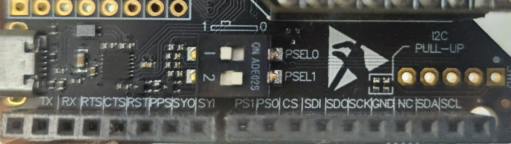

# Readme4RPI

# MTi IMU Parser Library

A **Python library** for reading and parsing data from **Xsens MTi IMU sensors** on a Raspberry Pi. Designed for simplicity and flexibility, it allows you to retrieve **specific sensor data** (e.g., Euler angles, GPS coordinates) without dealing with the full continuous stream.

---

## Features

- Connect to MTi IMU via serial port (`/dev/serial0` by default).
- Read **Euler angles** (Roll, Pitch, Yaw).
- Read **Latitude and Longitude** from GPS.
- Lightweight and easy-to-use on **Raspberry Pi** .
- Handles **checksum validation** and basic error handling.
- Library-style API – call only the data you need.

---

## Physical connections

Eg for RPI 4b+ (connections may vary across different boards),

```bash
RX of MTi to TX of RPI (pinout 08)
TX of MTi to RX of RPI (pinout 10)
GND of MTi to GND of RPI 
3.3v of MTi to 3.3v of RPI
```

- IMPORTANT: Ensure the MTi reciever is only connected to 3.3v as 5v will force it into debug/usb mode.

Switch the PSEL to UART HD mode with

```bash
PSEL 0 = 1
PSEL 0 = 0
```



As such

| PSEL 1  | PSEL 0 | Configuration |
| --- | --- | --- |
| 0 | 0 | UART FD |
| 0 | 1 | UART HD |
| 1 | 0 | SPI |
| 1 | 1 | 12C |

Different configs of PSEL for reference.

## Dependencies

No external dependencies beyond standard Python libraries and `pyserial`.

Install `pyserial` if not already installed:

```bash
pip install pyserial
```

Copy `mti_parser.py` into your project folder.

## Usage for Code

### 1. Import the library

```python
from MTI_rtk8_lib import MTiParser
```

### 2. Initialize the parser

```python
imu = MTiParser(port='/dev/serial0', baudrate=115200)
```

- **port**: Serial port where your MTi device is connected.
- **baudrate**: Communication speed (default `115200`).

### 3. Connect to the device

```python
if imu.connect():
    print("Connected successfully!")
else:
    print("Failed to connect")
```

### 4. Read specific data

### a. Read Euler angles (Roll, Pitch, Yaw)

```python
euler = imu.read_euler(timeout=3.0)  # timeout in seconds
if euler:
    roll, pitch, yaw = euler
    print(f"Euler angles: Roll={roll:.2f}, Pitch={pitch:.2f}, Yaw={yaw:.2f}")
else:
    print("No Euler angles data received")
```

### b. Read Latitude and Longitude

```python
latlon = imu.read_latlon(timeout=3.0)
if latlon:
    lat, lon = latlon
    print(f"Latitude: {lat:.6f}, Longitude: {lon:.6f}")
else:
    print("No GPS data received")
```

### 5. Disconnect

Always close the serial connection when done:

```python
imu.disconnect()
```

---

## Notes

- The library only parses **Euler angles** and **latitude/longitude** by default.
- You can extend it to parse other fields (e.g., acceleration, gyroscope, quaternion) by modifying the `parse_message()` method.
- Use the `timeout` parameter to wait for new data; the parser returns `None` if no valid data is received within the specified time.
- Ensure the MTi device is **powered and configured properly** to output the required data.

---

## Example: Full Script

```python
from MTI_rtk8_lib import MTiParser

imu = MTiParser(port='/dev/serial0', baudrate=115200)

if imu.connect():
    euler = imu.read_euler(timeout=3.0)
    if euler:
        roll, pitch, yaw = euler
        print(f"Euler: Roll={roll:.2f}, Pitch={pitch:.2f}, Yaw={yaw:.2f}")

    latlon = imu.read_latlon(timeout=3.0)
    if latlon:
        lat, lon = latlon
        print(f"GPS: Latitude={lat:.6f}, Longitude={lon:.6f}")

    imu.disconnect()

```

## Notes

- The library only parses **Euler angles** and **latitude/longitude** by default.
- You can extend it to parse other fields (e.g., acceleration, gyroscope, quaternion) by modifying the `parse_message()` method.
- Use the `timeout` parameter to wait for new data; the parser returns `None` if no valid data is received within the specified time.
- Ensure the MTi device is **powered and configured properly** to output the required data.

## List of datas available:

| Field Name | Description | Library Method | Data Type |
| --- | --- | --- | --- |
| `euler_angles` | Roll, Pitch, Yaw angles in degrees | `read_euler(timeout)` | `Tuple[float, float, float]` |
| `latitude_longitude` | Latitude and Longitude in degrees | `read_latlon(timeout)` | `Tuple[float, float]` |
| `quaternion` | Orientation quaternion | Extend `parse_message()` | `Tuple[float, float, float, float]` |
| `acceleration` | Linear acceleration (X, Y, Z) | Extend `parse_message()` | `Tuple[float, float, float]` |
| `rate_of_turn` | Angular velocity (X, Y, Z) | Extend `parse_message()` | `Tuple[float, float, float]` |
| `magnetic_field` | Magnetic field (X, Y, Z) | Extend `parse_message()` | `Tuple[float, float, float]` |
| `baro_pressure` | Barometric pressure in Pa | Extend `parse_message()` | `float` |

---

## License

MIT License – free to use, modify, and distribute.
